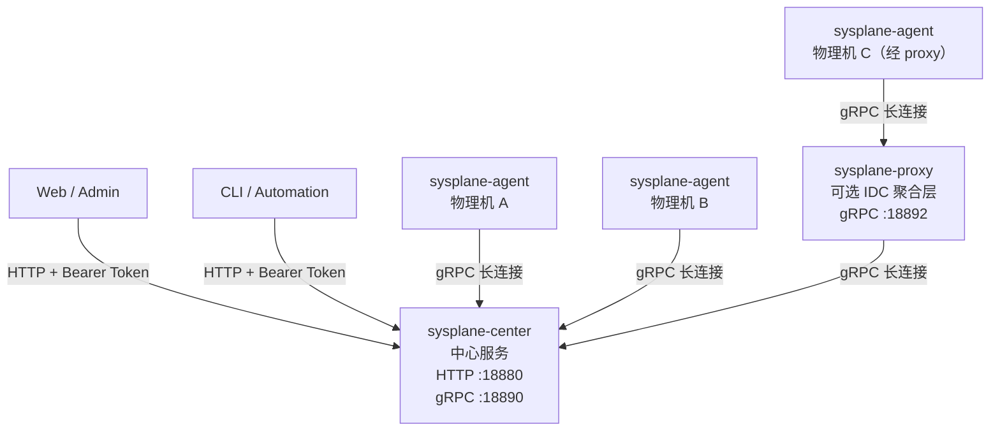

# Sysplane

Sysplane 是一个用 Go 编写的分布式远程访问控制平面，让 Web/Admin、CLI 和自动化脚本能够以统一的 HTTP API 访问远程物理机。

当前仓库已经提供两类对外控制面入口：

- 内嵌在 `sysplane-center` 内的完整 v1 Web Admin，访问路径为 `/web/`
- 独立 `sysplane` CLI，直接调用同一套 `/v1/...` HTTP API

两者复用同一后端契约，支持节点浏览、命令模板管理、Invocation 执行中心和审计查询。

---

## 项目特点

- 零外部依赖部署，单二进制静态编译
- 支持数万台物理机（通过 proxy 分层聚合，降低 center 压力）
- AI 助手无感知架构，只需与 center 交互，无需了解 agent/proxy 拓扑
- 全链路 Bearer Token 鉴权，支持 mTLS
- agent/proxy 断线自动重连，center 重启后自动恢复

---

## 系统架构



### 组件说明

| 组件 | 部署位置 | 职责 |
|------|----------|------|
| `sysplane-agent` | 每台被监控的物理机 | 采集硬件信息、执行文件操作、代理本地 HTTP |
| `sysplane-proxy` | IDC 内网入口（可选） | 聚合同机房多台 agent，支持多级级联 |
| `sysplane-center` | 公网或内网可达位置 | 控制面服务，提供 HTTP API 与 WebUI，管理所有 agent 连接 |

---

## 快速开始

### 编译

```bash
git clone https://github.com/jimyag/sysplane.git
cd sysplane
task build
# 产物输出到 bin/ 目录
```

依赖：Go 1.22+，[Task](https://taskfile.dev)

### 最小化部署（单台机器测试）

```bash
# 1. 启动 center
bin/sysplane-center -config deploy/config/center.yaml.example

# 2. 启动 agent（另一个终端）
bin/sysplane-agent -config deploy/config/agent.yaml.example

# 3. 打开 WebUI
# http://127.0.0.1:18880/web/

# 4. 使用 CLI
bin/sysplane --server http://127.0.0.1:18880 --token your-client-token nodes list
```

详细部署说明见 [docs/usage/getting-started.md](docs/usage/getting-started.md)。

---

## v1 管理面能力

当前 `sysplane-center` 已提供以下管理能力：

| 能力 | 说明 |
|------|------|
| 节点视图 | 浏览节点、能力、路由路径，并执行内置动作 |
| 命令模板 | 创建、更新、启停命令模板 |
| 透明执行 | 单节点同步执行命令模板，响应内容由命令输出决定 |
| Invocation 执行中心 | 统一执行内置动作和命令模板，支持同步/异步、结果查询和取消 |
| 审计查询 | 查看执行与模板变更相关的审计事件 |
| 节点安全配置 | 通过 admin API 远程读写 agent 安全配置，支持热重载，无需重启 agent |

命令模板的实际执行受 agent 侧白名单控制：`security.allowed_commands` 为空时，agent 拒绝执行任何命令。可通过 `GET/PATCH /v1/nodes/{id}/config` 动态更新白名单。

---

## WebUI

启动 `sysplane-center` 后，可直接在浏览器访问：

```text
http://<center-host>:<http-port>/web/
```

WebUI 当前支持：

- 使用 `client token` 或 `admin token` 登录
- 浏览节点、能力与快捷动作（每种动作独立渲染：sys.info 显示指标卡、sys.hardware 显示用量条、fs.list 显示文件浏览器、fs.read 显示代码查看器等）
- 管理命令模板（创建 / 更新 / 启停 / 调用）
- 查看 Invocation 列表、详情、结果并取消执行
- 查看审计事件
- 节点安全配置：在节点详情页读取并修改 agent 安全策略，保存后立即热重载

当前这套后台按 v1 范围已完整；RBAC、OIDC、审批流和动态策略控制台仍不在本轮范围内。

---

## HTTP API

### 节点

| 方法 | 路径 | 说明 |
|------|------|------|
| GET | `/v1/nodes` | 列出节点（支持 hostname/status 过滤） |
| GET | `/v1/nodes/{id}` | 查询节点详情 |
| GET | `/v1/nodes/{id}/capabilities` | 查询节点能力列表 |
| POST | `/v1/nodes/{id}/actions/{action}` | 执行内置动作（fs.list / fs.read / sys.info 等） |
| GET | `/v1/nodes/{id}/config` | 读取节点安全配置（client/admin token） |
| PATCH | `/v1/nodes/{id}/config` | 更新节点安全配置并热重载（admin token） |

### 命令模板

| 方法 | 路径 | 说明 |
|------|------|------|
| GET | `/v1/command-templates` | 列出模板 |
| POST | `/v1/command-templates` | 创建模板（admin token） |
| GET | `/v1/command-templates/{id}` | 查询模板详情 |
| PATCH | `/v1/command-templates/{id}` | 更新模板（admin token） |
| POST | `/v1/nodes/{id}/command-templates/{template_id}/invoke` | 在指定节点同步执行模板，透明透传命令输出 |

### 执行记录与审计

| 方法 | 路径 | 说明 |
|------|------|------|
| GET | `/v1/invocations` | 列出执行记录 |
| POST | `/v1/invocations` | 创建执行记录（支持 builtin / command_template） |
| GET | `/v1/invocations/{id}` | 查询执行记录 |
| GET | `/v1/invocations/{id}/results` | 查询各节点执行结果 |
| POST | `/v1/invocations/{id}:cancel` | 取消执行 |
| GET | `/v1/audit/events` | 列出审计事件 |
| GET | `/v1/audit/events/{id}` | 查询审计事件详情 |

### 透明执行语义

`POST /v1/nodes/{id}/command-templates/{template_id}/invoke` 是面向单节点同步调用的轻量端点，不产生 invocation 记录：

```
请求 body：{ "params": {}, "timeout_sec": 10 }

exit 0  → HTTP 200，Content-Type 由输出决定（text/plain 或 application/json），body = stdout
exit ≠ 0 → HTTP 422，application/json，{ "exit_code": N, "stdout": "...", "stderr": "..." }
节点异常 → HTTP 4xx/5xx，标准错误结构
```

响应头始终携带 `X-Exit-Code`。

---

## CLI

编译后会生成独立命令行工具：

```bash
bin/sysplane --server http://127.0.0.1:18880 --token your-client-token nodes list
bin/sysplane --server http://127.0.0.1:18880 --token your-client-token nodes get <node-id>
bin/sysplane --server http://127.0.0.1:18880 --token your-client-token commands invoke fs.read --node <node-id> --params '{"path":"/etc/hostname"}'
bin/sysplane --server http://127.0.0.1:18880 --token your-admin-token commands invoke echo.hello --nodes <node-id> --params '{}'
bin/sysplane --server http://127.0.0.1:18880 --token your-admin-token audit list
```

环境变量也可替代全局参数：

```bash
export SYSPLANE_SERVER=http://127.0.0.1:18880
export SYSPLANE_TOKEN=your-client-token
bin/sysplane nodes list
```

当前 CLI 覆盖：

- `nodes list|get|capabilities`
- `commands invoke ...`（统一执行 builtin / command template）
- `templates list|get|create|update`
- `invocations list|get|results|cancel|create`
- `audit list|get`

---

## 目录结构

```
api/
  proto/          — Protobuf 定义（tunnel.proto）
  tunnel/         — 生成的 Go gRPC 代码（勿手动修改）
bin/              — 编译产物（不提交到 git）
cmd/
  sysplane/        — CLI 二进制入口
  sysplane-agent/  — agent 二进制入口
  sysplane-center/ — center 二进制入口
  sysplane-proxy/  — proxy 二进制入口
deploy/
  config/         — 配置文件示例
  systemd/        — systemd 服务单元文件
docs/
  design/         — 架构与详细设计文档
  testing/        — 测试流程文档
  trouble/        — 故障记录
  usage/          — 用户使用指南
internal/
  pkg/            — 跨服务公共库（stream 重连器、tlsconf）
  sysplane-cli/    — CLI 内部实现
  sysplane-agent/  — agent 内部实现
  sysplane-center/ — center 内部实现
  sysplane-proxy/  — proxy 内部实现
```

---

## 开发

```bash
# 编译所有二进制
task build

# 运行单元测试
task test

# 静态检查
task lint
```

### 更新 Proto

修改 `api/proto/tunnel.proto` 后执行：

```bash
protoc \
  --go_out=api/tunnel --go_opt=paths=source_relative \
  --go-grpc_out=api/tunnel --go-grpc_opt=paths=source_relative \
  -I api/proto api/proto/tunnel.proto
```

### 本地端到端测试

详细步骤见 [docs/testing/local-e2e-test.md](docs/testing/local-e2e-test.md)。

---

## 文档索引

| 文档 | 说明 |
|------|------|
| [docs/design/overview.md](docs/design/overview.md) | 整体架构详细设计 |
| [docs/design/sys-mcp-agent.md](docs/design/sys-mcp-agent.md) | agent 详细设计 |
| [docs/design/sys-mcp-center.md](docs/design/sys-mcp-center.md) | center 详细设计 |
| [docs/design/sys-mcp-proxy.md](docs/design/sys-mcp-proxy.md) | proxy 详细设计 |
| [docs/design/implementation-status.md](docs/design/implementation-status.md) | 设计与实现状态对照 |
| [docs/usage/getting-started.md](docs/usage/getting-started.md) | 用户快速上手指南 |
| [docs/testing/local-e2e-test.md](docs/testing/local-e2e-test.md) | 本地端到端测试流程 |
| [docs/trouble/001-gitignore-binary-leak.md](docs/trouble/001-gitignore-binary-leak.md) | 故障记录：.gitignore 导致二进制泄露 |
| [AGENTS.md](AGENTS.md) | coding agent 工作指南 |

---

## License

MIT
