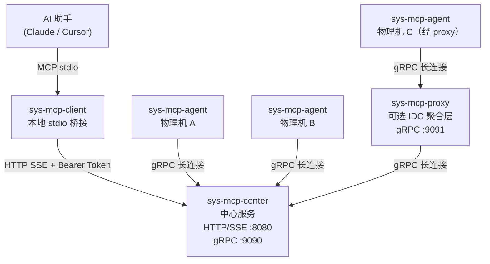

# sys-mcp

sys-mcp 是一个用 Go 编写的分布式 MCP（Model Context Protocol）平台，让 AI 助手（Claude、Cursor 等）能够实时查询远程物理机的硬件资源、文件系统信息，并代理访问机器上的本地 HTTP 服务。

---

## 项目特点

- 零外部依赖部署，单二进制静态编译
- 支持数万台物理机（通过 proxy 分层聚合，降低 center 压力）
- AI 助手无感知架构，只需与 center 交互，无需了解 agent/proxy 拓扑
- 全链路 Bearer Token 鉴权，支持 mTLS
- agent/proxy 断线自动重连，center 重启后自动恢复

---

## 系统架构



### 组件说明

| 组件 | 部署位置 | 职责 |
|------|----------|------|
| `sys-mcp-agent` | 每台被监控的物理机 | 采集硬件信息、执行文件操作、代理本地 HTTP |
| `sys-mcp-proxy` | IDC 内网入口（可选） | 聚合同机房多台 agent，支持多级级联 |
| `sys-mcp-center` | 公网或内网可达位置 | MCP 服务端，管理所有 agent 连接，路由工具调用 |
| `sys-mcp-client` | 用户本地机器 | stdio MCP 桥接，让 AI 助手与 center 通信 |

---

## 快速开始

### 编译

```bash
git clone https://github.com/jimyag/sys-mcp.git
cd sys-mcp
task build
# 产物输出到 bin/ 目录
```

依赖：Go 1.21+，[Task](https://taskfile.dev)

### 最小化部署（单台机器测试）

```bash
# 1. 启动 center
bin/sys-mcp-center -config deploy/config/center.yaml.example

# 2. 启动 agent（另一个终端）
bin/sys-mcp-agent -config deploy/config/agent.yaml.example

# 3. 配置 AI 助手（以 Claude Desktop 为例）
# 在 ~/Library/Application Support/Claude/claude_desktop_config.json 中添加：
# {
#   "mcpServers": {
#     "sys-mcp": {
#       "command": "/path/to/bin/sys-mcp-client",
#       "args": ["-config", "~/.config/sys-mcp/client.yaml"]
#     }
#   }
# }
```

详细部署说明见 [docs/usage/getting-started.md](docs/usage/getting-started.md)。

---

## 可用工具

center 向 AI 暴露以下 8 个工具：

| 工具名 | 说明 |
|--------|------|
| `list_agents` | 列出所有已注册节点及其状态 |
| `get_hardware_info` | 获取目标机器的 CPU、内存、磁盘信息 |
| `list_directory` | 列出目录内容 |
| `read_file` | 读取文件内容 |
| `stat_file` | 获取文件元数据（大小、权限、修改时间） |
| `check_path_exists` | 检查路径是否存在 |
| `search_file_content` | 在文件中搜索内容 |
| `proxy_local_api` | 代理访问目标机器上的本地 HTTP 服务 |

所有工具（除 `list_agents` 外）都需要 `target_host` 参数指定目标机器。

---

## 目录结构

```
api/
  proto/          — Protobuf 定义（tunnel.proto）
  tunnel/         — 生成的 Go gRPC 代码（勿手动修改）
bin/              — 编译产物（不提交到 git）
cmd/
  sys-mcp-agent/  — agent 二进制入口
  sys-mcp-center/ — center 二进制入口
  sys-mcp-client/ — client 二进制入口
  sys-mcp-proxy/  — proxy 二进制入口
deploy/
  config/         — 配置文件示例
  systemd/        — systemd 服务单元文件
docs/
  design/         — 架构与详细设计文档
  testing/        — 测试流程文档
  trouble/        — 故障记录
  usage/          — 用户使用指南
internal/
  pkg/            — 跨服务公共库（stream 重连器、tlsconf）
  sys-mcp-agent/  — agent 内部实现
  sys-mcp-center/ — center 内部实现
  sys-mcp-client/ — client 内部实现
  sys-mcp-proxy/  — proxy 内部实现
```

---

## 开发

```bash
# 编译所有二进制
task build

# 运行单元测试
task test

# 静态检查
task vet
```

### 更新 Proto

修改 `api/proto/tunnel.proto` 后执行：

```bash
protoc \
  --go_out=api/tunnel --go_opt=paths=source_relative \
  --go-grpc_out=api/tunnel --go-grpc_opt=paths=source_relative \
  -I api/proto api/proto/tunnel.proto
```

### 本地端到端测试

详细步骤见 [docs/testing/local-e2e-test.md](docs/testing/local-e2e-test.md)。

---

## 文档索引

| 文档 | 说明 |
|------|------|
| [docs/design/overview.md](docs/design/overview.md) | 整体架构详细设计 |
| [docs/design/sys-mcp-agent.md](docs/design/sys-mcp-agent.md) | agent 详细设计 |
| [docs/design/sys-mcp-center.md](docs/design/sys-mcp-center.md) | center 详细设计 |
| [docs/design/sys-mcp-proxy.md](docs/design/sys-mcp-proxy.md) | proxy 详细设计 |
| [docs/design/sys-mcp-client.md](docs/design/sys-mcp-client.md) | client 详细设计 |
| [docs/design/implementation-status.md](docs/design/implementation-status.md) | 设计与实现状态对照 |
| [docs/usage/getting-started.md](docs/usage/getting-started.md) | 用户快速上手指南 |
| [docs/testing/local-e2e-test.md](docs/testing/local-e2e-test.md) | 本地端到端测试流程 |
| [docs/trouble/001-gitignore-binary-leak.md](docs/trouble/001-gitignore-binary-leak.md) | 故障记录：.gitignore 导致二进制泄露 |
| [AGENTS.md](AGENTS.md) | coding agent 工作指南 |

---

## License

MIT
