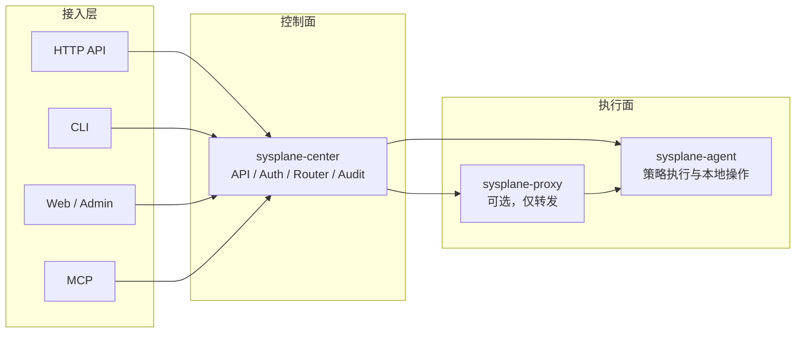

# Sysplane 目标定位与详细设计方向

本文档在“目标定位”基础上补齐详细设计，用于指导 `sys-mcp` 向 `Sysplane` 目标态演进。  
当前仓库仍以 `sys-mcp` 为模块名与二进制名；在实现与迁移完成前，名称与目录可以暂不调整，但新设计均以 **Sysplane 目标模型** 为准。

---

## 一、品牌与仓库定位的变化

- 对外名称：`Sysplane`
- 产品定位：由“面向 AI 的分布式 MCP 资源查询平台”演进为“对远程物理机提供受控访问与执行能力的统一平台”
- 接入方式：`HTTP API`、`CLI`、`Web/Admin`、`MCP` 并列，MCP 不再是唯一主轴
- 核心原则：统一能力面、统一安全模型、统一审计链路、统一节点路由

这意味着后续设计不能再围绕“给 MCP 暴露几个工具”展开，而要围绕以下问题展开：

1. 平台对外暴露哪些稳定资源与动作
2. 这些动作如何映射到底层 agent 执行
3. 安全边界、审批边界、审计边界如何一致生效
4. CLI / Web / MCP 如何共享同一套后端契约

---

## 二、目标能力与边界

### 2.1 平台要解决的问题

Sysplane 提供三类基础能力：

- 节点发现与状态查询：节点在线状态、基础硬件信息、系统信息、连通路径
- 文件系统访问：目录浏览、文件读取、元数据查看、受控写入
- 远程执行：执行系统内置动作或用户注册的命令模板，并返回结构化结果

### 2.2 明确不解决的问题

以下能力不属于当前目标态：

- 完整配置管理与批量变更编排
- 长时任务调度平台
- 实时监控时序数据库
- 通用容器编排控制面

### 2.3 安全边界

“可访问远程机器”不等于“完全无边界调用”。一期边界主要由 center 侧 token 鉴权和 agent 侧最基本的运行时限制共同决定：

- 路径白名单 / 黑名单
- 文件大小上限
- 命令执行超时
- 并发数上限
- 是否允许写入
- 是否允许执行
- 命令模板参数 schema
- 调用方 token 类型与来源

因此，对外文案和实现语义都应避免“任意访问所有数据”这一误导性表述。

---

## 三、总体架构



### 3.1 角色定义

- `center`
  - 对外唯一控制面
  - 提供 HTTP API、Admin 能力、可选 MCP 接入
  - 负责鉴权、路由、审计、策略编排
- `agent`
  - 部署在目标物理机
  - 执行本地文件访问、系统信息采集、命令执行
  - 在本地落实路径、超时、权限等安全限制
- `proxy`
  - 只承担网络可达性与转发
  - 不承载业务语义，不维护业务状态，不对外提供产品能力

### 3.2 设计原则

- 统一契约：CLI、Web、MCP 调用同一后端语义
- 稳定 API：对外采用版本化 HTTP API，例如 `/v1/...`
- center 无业务直连假设：不要求 center 必须能主动直连所有 agent
- proxy 最小化：避免在 proxy 堆积策略、缓存、审计等逻辑
- agent 侧约束：即使 center 鉴权通过，agent 仍需执行最基本的运行时限制

---

## 四、统一领域模型

详细设计首先要统一对象模型，否则 API、CLI、Web、MCP 会各自发散。

### 4.1 Node

`Node` 表示一个可被平台路由和操作的目标节点，通常对应一个 agent 实例。

建议字段：

```yaml
id: node_01H...
hostname: db-prod-01
labels:
  idc: sh-1
  env: prod
  role: mysql
status: online
platform:
  os: linux
  arch: amd64
  kernel: 6.6.0
agent:
  version: 0.1.0
  connected_via:
    - proxy-sh-01
last_seen_at: 2026-05-07T10:00:00Z
registered_at: 2026-05-01T08:00:00Z
```

约束：

- `id` 为平台稳定主键，不建议长期依赖 `hostname` 作为唯一标识
- `hostname` 可读性强，但可能变化
- `labels` 用于筛选、批量选择与审计聚合
### 4.2 Capability

`Capability` 表示节点可暴露的能力集合，用于界定“能做什么”，而不是“谁能调用”。

能力可分为：

- `builtin`
  - `fs.list`
  - `fs.read`
  - `sys.info`
  - `cmd.exec`
- `registered-command`
  - 由管理员注册的命令模板
  - 例如 `docker.ps`、`journal.tail`、`smartctl.health`

建议不要把“命令模板”直接视为底层脚本文件，而应视为一种受控能力对象。

### 4.3 CommandTemplate

用户扩展能力通过 `CommandTemplate` 建模。

建议字段：

```yaml
id: cmd_docker_ps
name: docker.ps
description: List containers on target node
mode: readonly
target_os:
  - linux
executor:
  type: process
  command: /usr/bin/docker
  args:
    - ps
    - --format
    - "{{.Names}}\t{{.Status}}"
params_schema:
  type: object
  properties:
    all:
      type: boolean
timeout_sec: 10
max_output_bytes: 262144
created_by: admin@example.com
```

约束：

- 模板需区分 `readonly` / `mutating` / `dangerous`
- 模板参数必须有 schema
- 模板必须显式声明超时与输出上限
- 模板只能通过受控参数注入，不允许自由拼接 shell 字符串

### 4.4 Invocation

所有一次性操作，无论来源于 API、CLI、Web 还是 MCP，最终都应统一为 `Invocation`。

建议字段：

```yaml
id: inv_01H...
type: builtin | command
action: fs.read | sys.info | docker.ps
target_selector:
  node_ids: ["node_01H..."]
requested_by:
  subject: user_123
  source: cli
status: pending | running | succeeded | failed | canceled | partial
timeout_sec: 15
created_at: 2026-05-07T10:00:00Z
started_at: 2026-05-07T10:00:01Z
finished_at: 2026-05-07T10:00:02Z
```

`Invocation` 是审计、重试、故障定位、异步扩展的基础对象，应成为统一执行面主语。

---

## 五、接入层设计

### 5.1 HTTP API 是一等公民

目标态里，HTTP API 是对外稳定契约，其他入口均复用它的语义。

建议原则：

- 使用版本化路径：`/v1/...`
- 对资源和动作进行明确建模
- 错误码稳定
- 支持同步调用与异步调用两种模式
- 流式输出能力单独设计，不污染普通查询接口

### 5.2 CLI

CLI 应直接调用 HTTP API，而不是再套一层本地 stdio MCP 桥接。

原因：

- 调试简单
- 契约清晰
- 便于脚本化
- 错误处理更可控
- 避免为 CLI 重复维护 MCP 适配逻辑

CLI 更像 `gh` 或 `kubectl` 风格的控制平面工具，而不是一个“帮 AI 转协议”的薄桥。

### 5.3 Web / Admin

Web 与 Admin 共享同一 API 面，但关注点不同：

- Web：人工操作、结果查看、审计查询
- Admin：节点管理、策略管理、命令模板管理、权限配置

建议在鉴权上区分“业务调用凭证”和“管理凭证”，不要混用。

### 5.4 MCP

MCP 建议作为适配层存在：

- 将 MCP tool 映射为对 HTTP API 的调用
- tool 的名称与参数保持 AI 友好
- tool 返回结构尽量简洁，但不要丢失底层错误语义

这样可以让 MCP 成为能力投影，而不是系统真实核心接口。

---

## 六、API 资源与动作设计

以下为目标态推荐的最小 API 集合。

### 6.1 节点查询

```text
GET    /v1/nodes
GET    /v1/nodes/{node_id}
GET    /v1/nodes/{node_id}/capabilities
```

语义：

- `/v1/nodes` 支持按 `hostname`、`label`、`status`、`idc`、`env` 过滤
- 返回对象应包含在线状态、最近心跳、平台信息、路由路径摘要
- 不在该接口返回超大硬件详情或完整审计信息，避免职责混乱

### 6.2 文件系统内置动作

建议使用“动作式子资源”，避免把执行语义硬塞进 REST 名词。

```text
POST   /v1/nodes/{node_id}/actions/fs:list
POST   /v1/nodes/{node_id}/actions/fs:read
POST   /v1/nodes/{node_id}/actions/fs:stat
POST   /v1/nodes/{node_id}/actions/fs:write
```

请求示例：

```json
{
  "path": "/var/log",
  "limit": 100
}
```

设计约束：

- `fs:list` 仅返回必要元数据
- `fs:read` 需要路径、偏移、长度参数
- `fs:write` 默认关闭，只有 token 类型和策略都允许时才可用
- 读取大文件时应优先支持偏移与长度，避免一次性整文件传输

### 6.3 系统信息内置动作

```text
POST   /v1/nodes/{node_id}/actions/sys:info
POST   /v1/nodes/{node_id}/actions/sys:hardware
POST   /v1/nodes/{node_id}/actions/sys:network
```

注意：

- `sys:info` 返回轻量、通用信息
- `sys:hardware` 可相对昂贵，建议明确超时和缓存策略
- 不要设计成“返回一切系统细节”的巨型接口

### 6.4 命令模板管理与调用

```text
GET    /v1/command-templates
POST   /v1/command-templates
GET    /v1/command-templates/{template_id}
PATCH  /v1/command-templates/{template_id}
POST   /v1/command-templates/{template_id}:invoke
```

为什么不建议 `POST /v1/nodes/{id}/execute` 作为长期主接口：

- 语义过宽
- 不利于审计分类
- 不利于权限细化
- 不利于 UI 展示和模板治理

如果确实需要“直接执行”能力，建议仅保留为管理域高权限接口，并明确标记为高风险能力。

### 6.5 Invocation 查询

```text
POST   /v1/invocations
GET    /v1/invocations/{invocation_id}
GET    /v1/invocations/{invocation_id}/results
POST   /v1/invocations/{invocation_id}:cancel
```

`POST /v1/invocations` 是统一入口，适合批量、多节点、异步执行：

```json
{
  "action": "fs.read",
  "targets": {
    "node_ids": ["node_01", "node_02"]
  },
  "params": {
    "path": "/etc/hostname"
  },
  "timeout_sec": 10,
  "async": true
}
```

建议：

- 单节点简单动作可保留快捷接口
- 复杂、批量、需要追踪状态的调用统一落到 `invocations`

### 6.6 审计与管理

```text
GET    /v1/audit/events
GET    /v1/audit/events/{event_id}
```

管理面 API 应与普通业务调用面分域、分权、分 token。

---

## 七、执行模型

### 7.1 同步与异步

平台需要同时支持同步和异步执行。

同步适用于：

- 单节点轻量读取
- 快速系统信息查询
- AI 工具调用

异步适用于：

- 批量节点操作
- 可能超时的动作
- 需要后续查询结果或取消的任务

建议规则：

- 小于固定超时阈值且单节点调用时，可直接同步等待结果
- 超出阈值或多节点调用时，center 自动落为异步 `Invocation`

### 7.2 执行链路

标准执行流程：

1. 调用方请求 center
2. center 做身份认证
3. center 做 token 校验与动作预检查
4. center 解析目标节点
5. center 创建 `Invocation` 与审计事件
6. center 选择路由并下发到 agent
7. agent 执行运行时限制检查
8. agent 执行动作
9. agent 返回结构化结果
10. center 汇总结果、更新状态、写入审计
11. 返回调用方

核心点：

- center 负责“平台视角的可调用性”
- agent 负责“机器视角的可执行性”
- 两端都需要检查，而不是只信任一端

### 7.3 结果模型

建议统一结果结构：

```json
{
  "invocation_id": "inv_01",
  "status": "succeeded",
  "results": [
    {
      "node_id": "node_01",
      "status": "succeeded",
      "started_at": "2026-05-07T10:00:01Z",
      "finished_at": "2026-05-07T10:00:02Z",
      "data": {},
      "error": null
    }
  ]
}
```

约束：

- 批量调用必须允许部分成功
- 错误要定位到具体节点
- `data` 与 `error` 不应同时为有效值

### 7.4 取消与超时

每个执行请求都应具备：

- center 侧超时
- agent 侧超时
- 显式取消

处理原则：

- center 超时后应向 agent 发送取消信号
- agent 若已完成，可忽略取消并返回最终结果
- agent 若支持进程杀死，应在本地回收子进程
- 审计中需记录“是用户取消、中心超时还是 agent 本地超时”

---

## 八、网络拓扑与任务投递

文档前文已经指出：“按需 HTTP” 并不会降低复杂度，只会把复杂度转移到任务投递和 NAT 可达性。

因此，目标态建议维持以下原则：

- agent 主动向上游建连
- center 不假设可主动拨入 agent
- proxy 仅作为分层转发点

### 8.1 推荐连接模型

推荐延续长连接隧道模型：

- `agent -> proxy/center` 主动建连
- 必要时 `proxy -> 上级 proxy/center` 主动建连
- center 基于现有连接下发请求

优点：

- NAT 友好
- 路由明确
- 更容易支持请求-响应与取消
- 适合双向事件和心跳

### 8.2 不推荐的替代模型

如果改成 “agent 定时拉取任务”：

- 请求延迟会增加
- 取消语义更复杂
- 批量请求扇出更难控制
- 连接闲时虽更简单，但总体协议复杂度并不会更低

除非明确追求“完全无长连接”部署模型，否则不建议优先采用。

### 8.3 proxy 的严格边界

proxy 只做：

- 下游连接接入
- 上游转发
- 必要的连接元数据透传

proxy 不做：

- token 校验
- 审计落库
- 命令模板管理
- 结果缓存
- 独立业务 API

这样才能避免把 proxy 演变成“次级控制面”。

---

## 九、安全模型

安全是 Sysplane 的核心，不是附属章节。

### 9.1 认证分层

建议至少区分四类主体：

- 人类用户
- 自动化客户端
- agent / proxy
- center 管理员

建议认证方式：

- API / CLI：Bearer token，后续可扩展 OIDC
- Web / Admin：强认证，优先走企业身份系统
- agent / proxy 上游连接：独立 token 或 mTLS

`agent token` 与 `client token` 必须分开管理，不能混用。

### 9.2 一期鉴权模型

一期不引入 RBAC，只做 token 分域与最小权限控制。

建议至少区分三类 token：

- `client token`
  - 供 CLI、MCP client、自动化程序调用业务 API
- `admin token`
  - 供 Web/Admin 或管理脚本调用管理 API
- `agent token`
  - 供 agent / proxy 向上游注册与维持连接

一期判定维度建议收敛为：

- token 类型
- 动作类型
- 是否命中高风险能力
- 是否满足最小运行时限制

也就是说，一期先做“这个 token 能不能访问这一类 API / 动作”，不做细粒度“某个用户对某类节点拥有哪些角色权限”。

### 9.3 最小运行时限制

一期不做路径权限控制，只保留最基本的资源限制，建议最小字段包含：

- `max_read_bytes`
- `max_exec_timeout_sec`
- `max_concurrency`

命令执行是平台核心能力之一；在一期里，命令由用户提供或注册，因此不再引入 `blocked_paths`、`allow_exec`、`allow_write` 这类权限控制项，避免把简单版本重新做复杂。运行时限制可以由 center 下发，也可以由 agent 启动配置定义，但执行时必须有清晰、可解释的最终生效视图。

### 9.4 高风险动作

以下能力默认视为高风险：

- 文件写入
- 修改系统配置
- 建议处理方式：

- 独立 token 域或独立高权限 token
- 审计增强
- 后续可扩展审批流

---

## 十、审计与可观测性

### 10.1 审计事件模型

所有调用都应写审计事件，至少包含：

- 谁发起
- 通过什么入口发起
- 对哪些节点发起
- 发起了什么动作
- 参数摘要
- 是否命中高风险策略
- 结果如何
- 花费多长时间

建议把“原始参数”和“可展示摘要”分离，避免日志或页面直接暴露敏感数据。

### 10.2 日志

日志建议分层：

- access log：记录 API 调用
- audit log：记录安全与执行事件
- service log：记录组件自身错误与运行状态

要求：

- 全链路 `request_id`
- 节点相关日志带 `node_id`
- 执行相关日志带 `invocation_id`

### 10.3 指标

建议最小指标集合：

- 在线节点数
- 请求总数 / 失败数
- 不同动作耗时分布
- agent 连接数
- proxy 层级分布
- token 鉴权拒绝次数
- 超时次数

### 10.4 跟踪

若后续引入 tracing，建议重点覆盖：

- API 接入
- token 鉴权判断
- 路由选择
- 下发 agent
- agent 本地执行
- 结果聚合

---

## 十一、错误模型

错误必须可区分、可审计、可被 CLI/MCP 正确翻译。

建议错误分类：

- `UNAUTHORIZED`
- `FORBIDDEN`
- `NODE_NOT_FOUND`
- `NODE_OFFLINE`
- `CAPABILITY_DISABLED`
- `POLICY_DENIED`
- `INVALID_ARGUMENT`
- `TIMEOUT`
- `CANCELED`
- `AGENT_EXEC_ERROR`
- `UPSTREAM_UNAVAILABLE`
- `INTERNAL_ERROR`

要求：

- 对外错误码稳定
- 错误消息可读但不过度暴露内部细节
- MCP 映射时保留原始错误类型，避免统一折叠成模糊字符串

---

## 十二、MCP 适配策略

MCP 工具建议按“高频、低复杂度”原则设计，不要把整个 HTTP API 原样映射成几十个碎工具。

推荐最小工具集：

- `list_nodes`
- `read_file`
- `list_directory`
- `get_system_info`
- `run_command_template`

设计原则：

- tool 输入保持简洁
- center 内部再转换成统一 `Invocation`
- tool 返回结果可读，但保留 `node_id`、`invocation_id`、错误类型

对于复杂的批量任务、模板管理、审计查询，不建议优先暴露给 MCP；这些更适合 API/CLI/Web。

---

## 十三、与当前实现的差异与重构落点

当前 `sys-mcp` 与目标态的关键差异：

1. 当前 center 对外主要是 MCP 面，缺少稳定业务 API
2. 当前 client 更像协议桥接，不是完整 CLI
3. 当前能力围绕“工具调用”组织，不是围绕“资源 + invocation”组织
4. 当前安全与管理面模型仍偏基础，尚未形成完整 token 分域 / 审计 / 模板治理体系

建议重构落点：

### 阶段一：统一控制面语义

- 在 center 内引入统一 action / invocation 模型
- 把现有 MCP tool 调用收口到统一执行层
- 明确节点、能力、模板、审计对象

### 阶段二：建立稳定 HTTP API

- 提供 `/v1/nodes`、`/v1/command-templates`、`/v1/invocations`
- CLI 直接走 HTTP API
- MCP 改为 API 适配层

### 阶段三：补齐管理面

- 策略管理
- token 分域
- 审计查询
- 高风险动作隔离

### 阶段四：完善体验与生态

- Web / Admin
- 更丰富的模板市场或共享机制
- 审批与变更留痕

---

## 十四、建议的实现约束

为了避免目标态落地过程中再次走向复杂化，建议明确以下实现约束：

- center 内部优先采用清晰的 service + store 分层，不引入过重框架
- proxy 不新增业务存储
- agent 执行面保持简单、可审计、可测试
- 命令模板严格结构化，不接受任意 shell 拼接
- 对外接口优先少而稳，不追求一次铺开全部能力

---

## 十五、后续拆分文档建议

本文档回答的是“产品与系统如何统一设计”，但还不是最终实现文档全集。建议按专题继续拆分：

1. 已补充 [docs/design/sysplane-api-v1.md](/Users/jimyag/src/github/jimyag/sys-mcp/docs/design/sysplane-api-v1.md)
   - API v1 草案
   - 请求响应示例
   - 错误码定义
2. 已补充 [docs/design/sysplane-security-model.md](/Users/jimyag/src/github/jimyag/sys-mcp/docs/design/sysplane-security-model.md)
   - token 分域
   - token 与凭证域
   - 最小运行时限制格式
3. 待补充 `sysplane-routing-topology.md`
   - center / proxy / agent 拓扑矩阵
   - 长连接协议与故障切换
4. 待补充 `sysplane-migration-plan.md`
   - 从现有 `sys-mcp` 渐进迁移到目标态的步骤

---

## 十六、文档状态

| 项目 | 说明 |
| ---- | ---- |
| 状态 | 详细设计方向稿，用于驱动重构拆分 |
| 适用范围 | `sys-mcp` 向 `Sysplane` 演进过程中的目标态设计 |
| 更新方式 | 架构方向变更时同步修订；细节实现另拆专门文档 |
